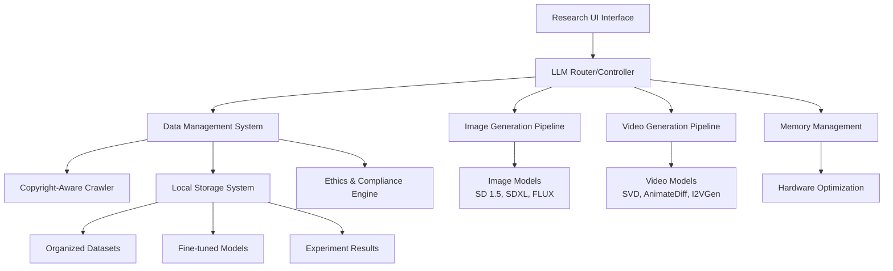
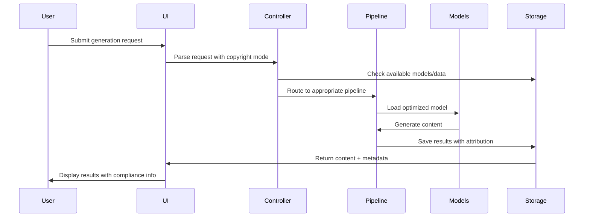
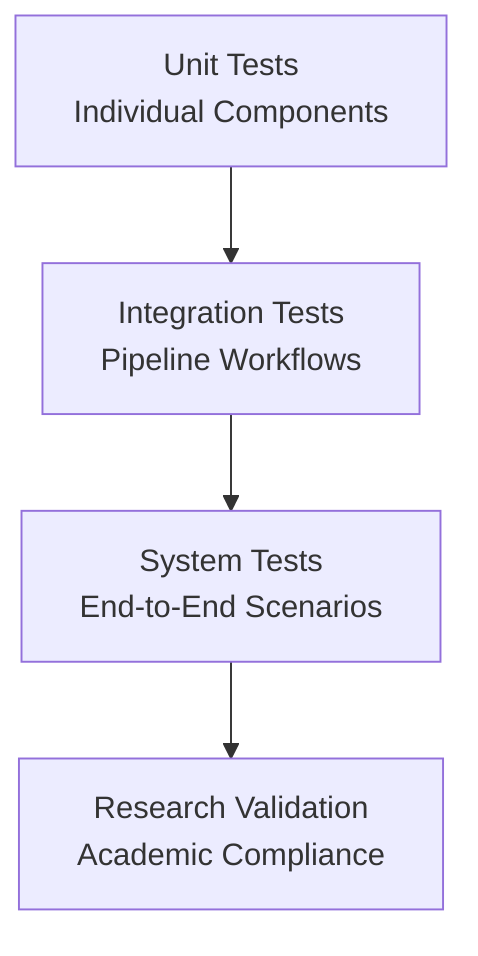

# Academic Multimodal LLM Experiment System - Design Document

## Overview

The Academic Multimodal LLM Experiment System is designed as a modular, research-focused platform that enables ethical experimentation with multimodal AI generation on consumer gaming hardware. The system emphasizes copyright compliance, hardware optimization, and systematic research methodology while providing a seamless interface for generating images and videos from text prompts.

The architecture follows a hub-and-spoke model with a central LLM controller coordinating specialized generation pipelines, supported by a copyright-aware data management system and optimized for various hardware configurations from 4GB to 24GB+ VRAM.

## Architecture

### High-Level System Architecture



### Component Interaction Flow



## Components and Interfaces

### 1. LLM Router/Controller

**Purpose**: Central intelligence for request routing and workflow coordination

**Core Interface**:
```python
class LLMController:
    def parse_request(self, prompt: str, context: dict) -> GenerationRequest
    def route_request(self, request: GenerationRequest) -> Pipeline
    def coordinate_workflow(self, steps: List[GenerationStep]) -> WorkflowResult
    def manage_context(self, conversation_id: str) -> ConversationContext
```

**Model Selection Strategy**:
- Primary: Llama 3.1 8B (16GB+ VRAM) or Phi-3-mini 3.8B (4GB VRAM)
- CPU offloading via Ollama for memory-constrained systems
- Context window optimization for multi-step workflows

**Key Responsibilities**:
- Intent classification (image/video/text generation)
- Prompt optimization for downstream models
- Multi-step workflow orchestration
- Conversation memory management

### 2. Image Generation Pipeline

**Architecture**:
```python
class ImageGenerationPipeline:
    def __init__(self, hardware_config: HardwareConfig):
        self.models = self._load_optimized_models(hardware_config)
        self.memory_manager = MemoryManager(hardware_config)
    
    def generate(self, prompt: str, style_config: StyleConfig) -> ImageResult
    def apply_lora(self, base_model: str, lora_path: str) -> Model
    def optimize_for_hardware(self, model: Model) -> OptimizedModel
```

**Model Hierarchy by Hardware**:
- **24GB+ VRAM**: FLUX.1-schnell (primary), SDXL-Turbo (fast)
- **8-16GB VRAM**: SDXL-Turbo (primary), SD 1.5 (fallback)
- **4GB VRAM**: SD 1.5 with optimizations, SD Tiny (ultra-fast)

**Optimization Strategies**:
- Attention slicing for memory reduction
- Sequential CPU offload for model components
- Mixed precision (FP16) inference
- XFormers memory-efficient attention

### 3. Video Generation Pipeline

**Architecture**:
```python
class VideoGenerationPipeline:
    def __init__(self, hardware_config: HardwareConfig):
        self.video_models = self._configure_video_models(hardware_config)
        self.frame_processor = FrameProcessor()
        self.temporal_optimizer = TemporalConsistencyEngine()
    
    def generate_video(self, prompt: str, duration: int) -> VideoResult
    def image_to_video(self, image: Image, motion_prompt: str) -> VideoResult
    def optimize_temporal_consistency(self, frames: List[Frame]) -> List[Frame]
```

**Model Selection by Capability**:
- **High-end**: Stable Video Diffusion (14 frames, full GPU)
- **Mid-range**: AnimateDiff + SD 1.5 (hybrid processing)
- **Low-end**: Text2Video-Zero (repurposed SD 1.5)
- **Fallback**: Keyframe generation + CPU interpolation

### 4. Copyright-Aware Data Management System

**Core Architecture**:
```python
class DataManagementSystem:
    def __init__(self):
        self.crawler = ResearchCrawler()
        self.classifier = LicenseClassifier()
        self.organizer = DatasetOrganizer()
        self.ethics_engine = EthicsComplianceEngine()
    
    def collect_data(self, sources: List[str], license_filter: LicenseType) -> Dataset
    def organize_by_license(self, raw_data: List[ContentItem]) -> OrganizedDataset
    def create_training_dataset(self, compliance_mode: ComplianceMode) -> TrainingDataset
```

**License Classification System**:
```python
class LicenseType(Enum):
    PUBLIC_DOMAIN = "public_domain"      # Wikimedia, Archive.org
    CREATIVE_COMMONS = "creative_commons" # Unsplash, Pexels, Pixabay
    FAIR_USE_RESEARCH = "fair_use_research" # Flickr, DeviantArt, YouTube
    COPYRIGHTED = "copyrighted"          # Shutterstock, Getty, Instagram
    UNKNOWN = "unknown"                  # Unclassified content
```

**Compliance Modes**:
- **Open Source Only**: Public Domain + Creative Commons
- **Research Safe**: Open Source + Fair Use Research
- **Full Dataset**: All content (research comparison only)

### 5. Hardware Optimization Engine

**Memory Management**:
```python
class MemoryManager:
    def __init__(self, vram_size: int):
        self.vram_size = vram_size
        self.optimization_strategy = self._select_strategy(vram_size)
    
    def optimize_model_loading(self, model: Model) -> OptimizedModel
    def manage_model_switching(self, current: Model, next: Model) -> None
    def clear_vram_cache(self) -> None
    def enable_cpu_offloading(self, model: Model) -> Model
```

**Hardware Configuration Profiles**:
- **GTX 1650 (4GB)**: Aggressive optimization, CPU offloading, SD 1.5 only
- **RTX 3070 (8GB)**: Balanced approach, SDXL-Turbo capable
- **RTX 4090 (24GB)**: Full capability, FLUX.1-schnell, concurrent models

### 6. Research Interface System

**UI Architecture**:
```python
class ResearchInterface:
    def __init__(self):
        self.gradio_app = self._create_gradio_interface()
        self.compliance_controller = ComplianceController()
        self.experiment_tracker = ExperimentTracker()
    
    def create_generation_interface(self) -> gr.Interface
    def create_compliance_dashboard(self) -> gr.Interface
    def create_experiment_tracker(self) -> gr.Interface
```

**Interface Components**:
- Generation tabs (Image/Video/Multi-modal)
- Copyright compliance selector
- Model performance monitor
- Experiment logging and comparison
- Dataset license analytics

## Data Models

### Core Data Structures

```python
@dataclass
class GenerationRequest:
    prompt: str
    output_type: OutputType  # IMAGE, VIDEO, MULTIMODAL
    style_config: StyleConfig
    compliance_mode: ComplianceMode
    hardware_constraints: HardwareConfig
    context: ConversationContext

@dataclass
class ContentItem:
    url: str
    local_path: Path
    license_type: LicenseType
    attribution: str
    metadata: Dict[str, Any]
    copyright_status: str
    research_safe: bool

@dataclass
class ExperimentResult:
    experiment_id: str
    timestamp: datetime
    request: GenerationRequest
    output_path: Path
    model_used: str
    generation_time: float
    quality_metrics: Dict[str, float]
    compliance_info: ComplianceInfo
```

### Database Schema

```sql
-- SQLite schema for local storage
CREATE TABLE experiments (
    id TEXT PRIMARY KEY,
    timestamp DATETIME,
    prompt TEXT,
    output_type TEXT,
    model_used TEXT,
    compliance_mode TEXT,
    generation_time REAL,
    output_path TEXT,
    quality_score REAL
);

CREATE TABLE content_items (
    id TEXT PRIMARY KEY,
    url TEXT,
    local_path TEXT,
    license_type TEXT,
    attribution TEXT,
    metadata JSON,
    created_at DATETIME
);

CREATE TABLE training_runs (
    id TEXT PRIMARY KEY,
    base_model TEXT,
    dataset_config TEXT,
    compliance_mode TEXT,
    training_params JSON,
    output_model_path TEXT,
    performance_metrics JSON,
    created_at DATETIME
);
```

## Error Handling

### Error Classification and Recovery

```python
class SystemError(Exception):
    """Base class for system errors"""
    pass

class MemoryError(SystemError):
    """VRAM or RAM exhaustion"""
    def handle(self):
        # Clear caches, reduce batch size, enable CPU offload
        pass

class ModelLoadError(SystemError):
    """Model loading or switching failure"""
    def handle(self):
        # Fallback to smaller model, retry with optimizations
        pass

class ComplianceError(SystemError):
    """Copyright or ethics violation"""
    def handle(self):
        # Block generation, log violation, suggest alternatives
        pass

class GenerationError(SystemError):
    """Content generation failure"""
    def handle(self):
        # Retry with different parameters, fallback model
        pass
```

### Recovery Strategies

1. **Memory Exhaustion**: Automatic fallback to smaller models, CPU offloading
2. **Model Failures**: Graceful degradation to backup models
3. **Compliance Violations**: Immediate blocking with educational feedback
4. **Network Issues**: Local-first operation with offline model serving
5. **Hardware Limitations**: Dynamic optimization based on detected capabilities

## Testing Strategy

### Testing Pyramid



### Test Categories

**1. Unit Tests**
- Model loading and optimization
- License classification accuracy
- Memory management functions
- Prompt processing and routing

**2. Integration Tests**
- Complete generation pipelines
- Data collection and organization workflows
- Hardware optimization across configurations
- UI component interactions

**3. System Tests**
- End-to-end generation scenarios
- Multi-modal workflow coordination
- Compliance mode enforcement
- Performance benchmarks across hardware

**4. Research Validation Tests**
- Copyright classification accuracy
- Fair use compliance verification
- Attribution tracking completeness
- Academic integrity validation

### Performance Benchmarks

**Target Performance Metrics**:
- Image generation: 30-60s (GTX 1650), 10-20s (RTX 3070), 5-10s (RTX 4090)
- Video generation: 5-15min (GTX 1650), 2-5min (RTX 3070), 1-2min (RTX 4090)
- Model switching: <60s across all hardware
- Memory optimization: <90% VRAM utilization
- Compliance checking: <1s per content item

### Continuous Integration

```yaml
# GitHub Actions workflow for testing
name: Research System CI
on: [push, pull_request]
jobs:
  test:
    runs-on: ubuntu-latest
    steps:
      - uses: actions/checkout@v2
      - name: Setup Python
        uses: actions/setup-python@v2
        with:
          python-version: '3.9'
      - name: Install dependencies
        run: pip install -r requirements.txt
      - name: Run unit tests
        run: pytest tests/unit/
      - name: Run integration tests
        run: pytest tests/integration/
      - name: Validate compliance engine
        run: python tests/validate_compliance.py
```

This design provides a comprehensive foundation for building an ethical, research-focused multimodal AI system that can adapt to various hardware configurations while maintaining strict copyright compliance and academic integrity.